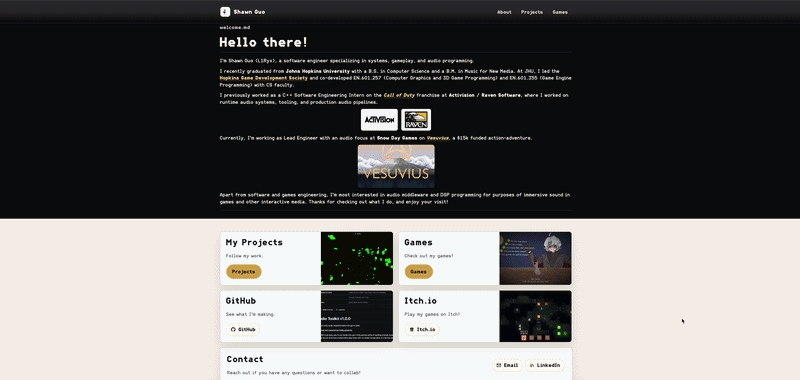

# Shawn Guo Personal Site

Personal portfolio site for my audio programming, systems work, and games.



Built with Astro, TypeScript, CSS, and Markdown content collections. Project pages are written as Markdown entries, then rendered into filtered cards and detail pages.

## Local Development

```sh
npm install
npm run dev
```

The local dev server runs at `http://localhost:4321`.

## Build

```sh
npm run build
npm run preview
```

The site deploys as static output to GitHub Pages at [shawnguo.dev](https://shawnguo.dev).
